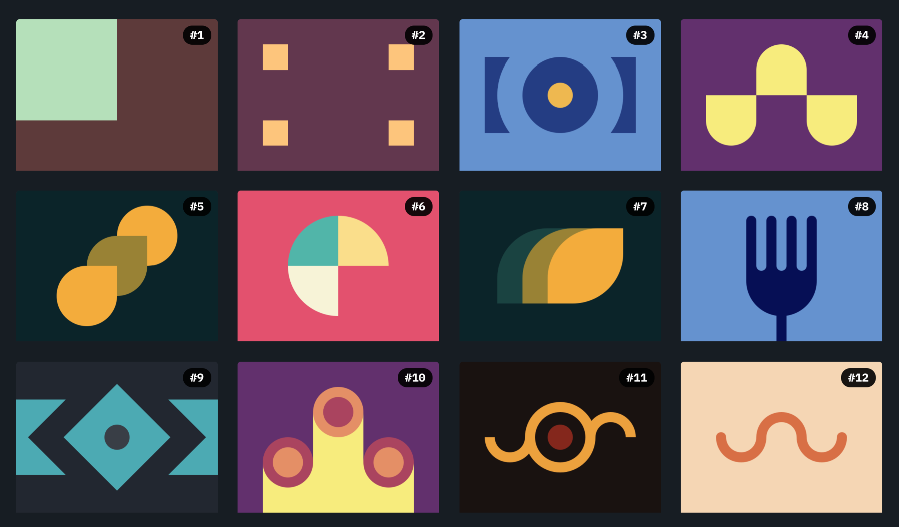

# 

## INDEX

### [Battle #1 - Pilot Battle](https://cssbattle.dev/battle/1)

- [#1 - Simply Square](https://cssbattle.dev/play/1) -> [HTML](./01.SimplySquare.html) - [MD](./01.SimplySquare.md)
- [#2 - Carrom](https://cssbattle.dev/play/2) -> [HTML](./02.Carrom.html) - [MD](./02.Carrom.md)
- [#3 - Push Button](https://cssbattle.dev/play/3) -> [HTML](./03.PushButton.html) - [MD](./03.PushButton.md)
- [#4 - Ups n Downs](https://cssbattle.dev/play/4) -> [HTML](./04.UpsnDowns.html) - [MD](./04.UpsnDowns.md)
- [#5 - Acid Rain](https://cssbattle.dev/play/5) -> [HTML](./05.AcidRain.html) - [MD](./05.AcidRain.md)
- [#6 - Missing Slice](https://cssbattle.dev/play/6) -> [HTML](./06.MissingSlice.html) - [MD](./06.MissingSlice.md)
- [#7 - Leafy Trail](https://cssbattle.dev/play/7) -> [HTML](./07.LeafyTrail.html) - [MD](./07.LeafyTrail.md)
- [#8 - Forking Crazy](https://cssbattle.dev/play/8) -> [HTML](./08.ForkingCrazy.html) - [MD](./08.ForkingCrazy.md)
- [#9 - Tesseract](https://cssbattle.dev/play/9) -> [HTML](./09.Tesseract.html) - [MD](./09.Tesseract.md)
- [#10 - Cloaked Spirits](https://cssbattle.dev/play/10) -> [HTML](./10.CloakedSpirits.html) - [MD](./10.CloakedSpirits.md)
- [#11 - Eye of Sauron](https://cssbattle.dev/play/11) -> [HTML](./11.EyeOfSauron.html) - [MD](./11.EyeOfSauron.md)
- [#12 - Wiggly Moustache](https://cssbattle.dev/play/12) -> [HTML](./12.WigglyMoustache.html) - [MD](./12.WigglyMoustache.md)
