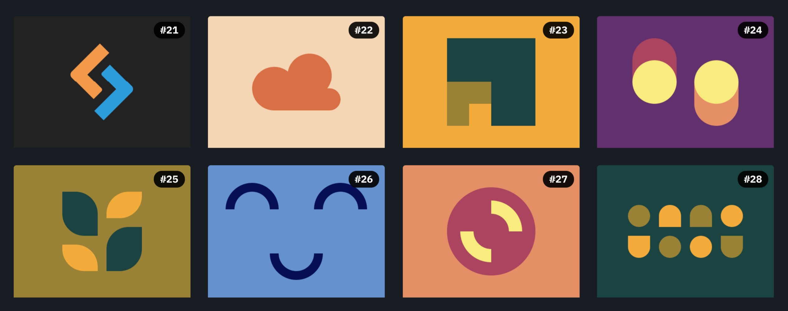

# 

## INDEX

### [Battle #4 - Display](https://cssbattle.dev/battle/4)

- [#21 - SitePoint Logo](https://cssbattle.dev/play/21) -> [HTML](./21.SitePointLogo.html) - [MD](./21.SitePointLogo.md)
- [#22 - Cloud](https://cssbattle.dev/play/22) -> [HTML](./22.Cloud.html) - [MD](./22.Cloud.md)
- [#23 - Boxception](https://cssbattle.dev/play/23) -> [HTML](./23.Boxception.html) - [MD](./23.Boxception.md)
- [#24 - Switches](https://cssbattle.dev/play/24) -> [HTML](./24.Switches.html) - [MD](./24.Switches.md)
- [#25 - Blossom](https://cssbattle.dev/play/25) -> [HTML](./25.Blossom.html) - [MD](./25.Blossom.md)
- [#26 - Smiley](https://cssbattle.dev/play/26) -> [HTML](./26.Smiley.html) - [MD](./26.Smiley.md)
- [#27 - Lock Up](https://cssbattle.dev/play/27) -> [HTML](./27.LockUp.html) - [MD](./27.LockUp.md)
- [#28 - Cups n Balls](https://cssbattle.dev/play/28) -> [HTML](./28.CupsNBalls.html) - [MD](./28.CupsNBalls.md)
