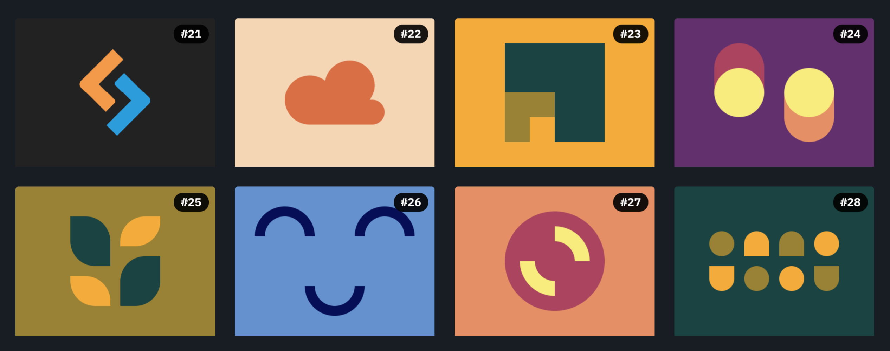
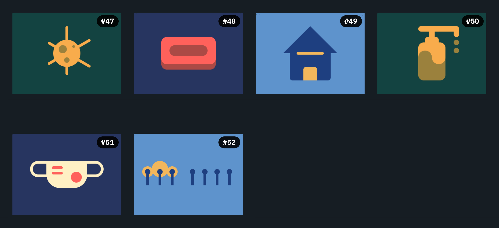
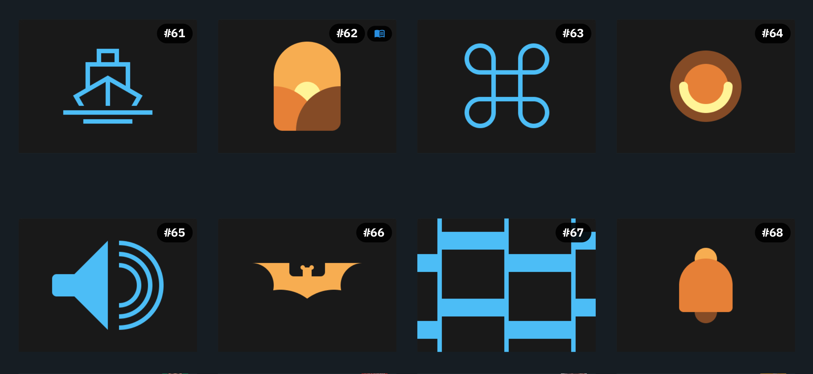

# 

Let's learn and enjoy codding CSS!

You could check here all [CSSBattle](https://cssbattle.dev) katas and several solutions for each.

Every kata has at least my solution (I'm aware they all can be improved, but they works) and some of them has a second one from top ten CSSBattle leaderboard.

Since game rules are not so compatible with real world best practices, you could find here two files per kata:

- The *.md files contains the solution/s coding for get higher score in the game.
- The *.html files contains only my solution coded for better understanding and readbility.

## INDEX

### [Battle #1 - Pilot Battle](https://cssbattle.dev/battle/1)

- [#1 - Simply Square](https://cssbattle.dev/play/1) -> [HTML](./Battle1-PilotBattle/01.SimplySquare.html) - [MD](./Battle1-PilotBattle/01.SimplySquare.md)
- [#2 - Carrom](https://cssbattle.dev/play/2) -> [HTML]() - [MD]()
- [#3 - Push Button](https://cssbattle.dev/play/3) -> [HTML]() - [MD]()
- [#4 - Ups n Downs](https://cssbattle.dev/play/4) -> [HTML]() - [MD]()
- [#5 - Acid Rain](https://cssbattle.dev/play/5) -> [HTML]() - [MD]()
- [#6 - Missing Slice](https://cssbattle.dev/play/6) -> [HTML]() - [MD]()
- [#7 - Leafy Trail](https://cssbattle.dev/play/7) -> [HTML]() - [MD]()
- [#8 - Forking Crazy](https://cssbattle.dev/play/8) -> [HTML]() - [MD]()
- [#9 - Tesseract](https://cssbattle.dev/play/9) -> [HTML]() - [MD]()
- [#10 - Cloaked Spirits](https://cssbattle.dev/play/10) -> [HTML]() - [MD]()
- [#11 - Eye of Sauron](https://cssbattle.dev/play/11) -> [HTML]() - [MD]()
- [#12 - Wiggly Moustache](https://cssbattle.dev/play/12) -> [HTML]() - [MD]()

### [Battle #2 -](https://cssbattle.dev/battle/2)

### [Battle #3 -](https://cssbattle.dev/battle/3)

### [Battle #4 -](https://cssbattle.dev/battle/4)

### [Battle #5 -](https://cssbattle.dev/battle/5)

### [Battle #6 -](https://cssbattle.dev/battle/6)

### [Battle #7 -](https://cssbattle.dev/battle/7)

### [Battle #8 -](https://cssbattle.dev/battle/8)

### [Battle #9 -](https://cssbattle.dev/battle/9)

### [Battle #10 -](https://cssbattle.dev/battle/10)

### [Battle #11 -](https://cssbattle.dev/battle/11)

### [Battle #12 -](https://cssbattle.dev/battle/12)

### [Battle #13 -](https://cssbattle.dev/battle/13)

### [Battle #14 -](https://cssbattle.dev/battle/14)

### [Battle #15 -](https://cssbattle.dev/battle/15)

### [Battle #16 -](https://cssbattle.dev/battle/16)

### [Battle #17 -](https://cssbattle.dev/battle/17)

