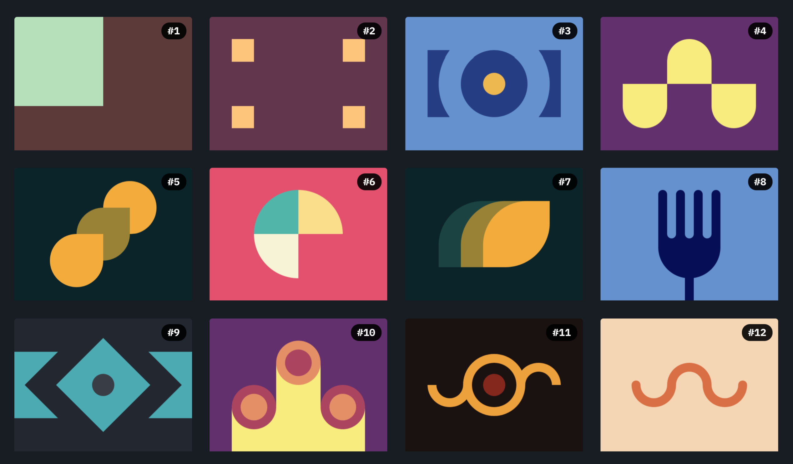

# 

Let's learn and enjoy codding CSS!

You could check here all [CSSBattle](https://cssbattle.dev) katas and several solutions for each.

Every kata has at least my solution (I'm aware they all can be improved, but they works) and some of them has a second one from top CSSBattle leaderboard.

Since game rules based on 'golfing' are not so compatible with real world best practices, you could find here two files per kata:

- The *.md files contains the solution/s coding for get higher score in the game.
- The *.html files contains only my solution coded for better understanding and readbility.
 
 

## INDEX

### [Battle #1 - Pilot Battle](https://cssbattle.dev/battle/1)

- [#1 - Simply Square](https://cssbattle.dev/play/1) -> [HTML](./Battle1-PilotBattle/01.SimplySquare.html) - [MD](./Battle1-PilotBattle/01.SimplySquare.md)
- [#2 - Carrom](https://cssbattle.dev/play/2) -> [HTML](./Battle1-PilotBattle/02.Carrom.html) - [MD](./Battle1-PilotBattle/02.Carrom.md)
- [#3 - Push Button](https://cssbattle.dev/play/3) -> [HTML](./Battle1-PilotBattle/03.PushButton.html) - [MD](./Battle1-PilotBattle/03.PushButton.md)
- [#4 - Ups n Downs](https://cssbattle.dev/play/4) -> [HTML](./Battle1-PilotBattle/04.UpsnDowns.html) - [MD](./Battle1-PilotBattle/04.UpsnDowns.md)
- [#5 - Acid Rain](https://cssbattle.dev/play/5) -> [HTML](./Battle1-PilotBattle/05.AcidRain.html) - [MD](./Battle1-PilotBattle/05.AcidRain.md)
- [#6 - Missing Slice](https://cssbattle.dev/play/6) -> [HTML](./Battle1-PilotBattle/06.MissingSlice.html) - [MD](./Battle1-PilotBattle/06.MissingSlice.md)
- [#7 - Leafy Trail](https://cssbattle.dev/play/7) -> [HTML](./Battle1-PilotBattle/07.LeafyTrail.html) - [MD](./Battle1-PilotBattle/07.LeafyTrail.md)
- [#8 - Forking Crazy](https://cssbattle.dev/play/8) -> [HTML](./Battle1-PilotBattle/08.ForkingCrazy.html) - [MD](./Battle1-PilotBattle/08.ForkingCrazy.md)
- [#9 - Tesseract](https://cssbattle.dev/play/9) -> [HTML](./Battle1-PilotBattle/09.Tesseract.html) - [MD](./Battle1-PilotBattle/09.Tesseract.md)
- [#10 - Cloaked Spirits](https://cssbattle.dev/play/10) -> [HTML](./Battle1-PilotBattle/10.CloakedSpirits.html) - [MD](./Battle1-PilotBattle/10.CloakedSpirits.md)
- [#11 - Eye of Sauron](https://cssbattle.dev/play/11) -> [HTML](./Battle1-PilotBattle/11.EyeOfSauron.html) - [MD](./Battle1-PilotBattle/11.EyeOfSauron.md)
- [#12 - Wiggly Moustache](https://cssbattle.dev/play/12) -> [HTML](./Battle1-PilotBattle/12.WigglyMoustache.html) - [MD](./Battle1-PilotBattle/12.WigglyMoustache.md)
 
 

### [Battle #2 - Visibility](https://cssbattle.dev/battle/2)

- [#13 - Simply Square](https://cssbattle.dev/play/13) -> [HTML](./Battle2-Visibility/13.TotallyTriangle.html) - [MD](./Battle2-Visibility/13.TotallyTriangle.md)
- [#14 - Web Maker Logo](https://cssbattle.dev/play/14) -> [HTML](./Battle2-Visibility/14.WebMakerLogo.html) - [MD](./Battle2-Visibility/14.WebMakerLogo.md)
- [#15 - Overlap](https://cssbattle.dev/play/15) -> [HTML](./Battle2-Visibility/15.Overlap.html) - [MD](./Battle2-Visibility/15.Overlap.md)
- [#16 - Eye of the Tiger](https://cssbattle.dev/play/16) -> [HTML](./Battle2-Visibility/16.EyeOfTheTiger.html) - [MD](./Battle2-Visibility/16.EyeOfTheTiger.md)
- [#17 - Fidget Spiner](https://cssbattle.dev/play/17) -> [HTML](./Battle2-Visibility/17.FidgetSpiner.html) - [MD](./Battle2-Visibility/17.FidgetSpiner.md)
- [#18 - Matrix](https://cssbattle.dev/play/18) -> [HTML](./Battle2-Visibility/18.Matrix.html) - [MD](./Battle2-Visibility/18.Matrix.md)
 
 

### [Battle #3 - Cursor](https://cssbattle.dev/battle/3)

- [#19 - Cube](https://cssbattle.dev/play/19) -> [HTML](./Battle3-Cursor/19.Cube.html) - [MD](./Battle3-Cursor/19.Cube.md)
- [#20 - Web Maker Logo](https://cssbattle.dev/play/20) -> [HTML](./Battle3-Cursor/20.Ticket.html) - [MD](./Battle3-Cursor/20.Ticket.md)
 
 

### [Battle #4 - Display](https://cssbattle.dev/battle/4)

- [#21 - SitePoint Logo](https://cssbattle.dev/play/21) -> [HTML](./Battle4-Display/21.SitePointLogo.html) - [MD](./Battle4-Display/21.SitePointLogo.md)
- [#22 - Cloud](https://cssbattle.dev/play/22) -> [HTML](./Battle4-Display/22.Cloud.html) - [MD](./Battle4-Display/22.Cloud.md)
- [#23 - Boxception](https://cssbattle.dev/play/23) -> [HTML](./Battle4-Display/23.Boxception.html) - [MD](./Battle4-Display/23.Boxception.md)
- [#24 - Switches](https://cssbattle.dev/play/24) -> [HTML](./Battle4-Display/24.Switches.html) - [MD](./Battle4-Display/24.Switches.md)
- [#25 - Blossom](https://cssbattle.dev/play/25) -> [HTML](./Battle4-Display/25.Blossom.html) - [MD](./Battle4-Display/25.Blossom.md)
- [#26 - Smiley](https://cssbattle.dev/play/26) -> [HTML](./Battle4-Display/26.Smiley.html) - [MD](./Battle4-Display/26.Smiley.md)
- [#27 - Lock Up](https://cssbattle.dev/play/27) -> [HTML](./Battle4-Display/27.LockUp.html) - [MD](./Battle4-Display/27.LockUp.md)
- [#28 - Cups n Balls](https://cssbattle.dev/play/28) -> [HTML](./Battle4-Display/28.CupsNBalls.html) - [MD](./Battle4-Display/28.CupsNBalls.md)
 
 

### [Battle #5 - Inline](https://cssbattle.dev/battle/5)

- [#29 - Suffocate](https://cssbattle.dev/play/29) -> [HTML](./Battle5-Inline/29.Suffocate.html) - [MD](./Battle5-Inline/29.Suffocate.md)
- [#30 - Horizon](https://cssbattle.dev/play/30) -> [HTML](./Battle5-Inline/30.Horizon.html) - [MD](./Battle5-Inline/30.Horizon.md)
 
 

### [Battle #6 - Conic](https://cssbattle.dev/battle/6)

- [#31 - Equals](https://cssbattle.dev/play/31) -> [HTML](./Battle6-Conic/31.Equals.html) - [MD](./Battle6-Conic/31.Equals.md)
- [#32 - Band-aid](https://cssbattle.dev/play/32) -> [HTML](./Battle6-Conic/32.Band-aid.html) - [MD](./Battle6-Conic/32.Band-aid.md)
 
 

### [Battle #7 -](https://cssbattle.dev/battle/7)

### [Battle #8 -](https://cssbattle.dev/battle/8)

### [Battle #9 -](https://cssbattle.dev/battle/9)

### [Battle #10 -](https://cssbattle.dev/battle/10)

### [Battle #11 -](https://cssbattle.dev/battle/11)

### [Battle #12 -](https://cssbattle.dev/battle/12)

### [Battle #13 -](https://cssbattle.dev/battle/13)

### [Battle #14 -](https://cssbattle.dev/battle/14)

### [Battle #15 -](https://cssbattle.dev/battle/15)

### [Battle #16 -](https://cssbattle.dev/battle/16)

### [Battle #17 -](https://cssbattle.dev/battle/17)

